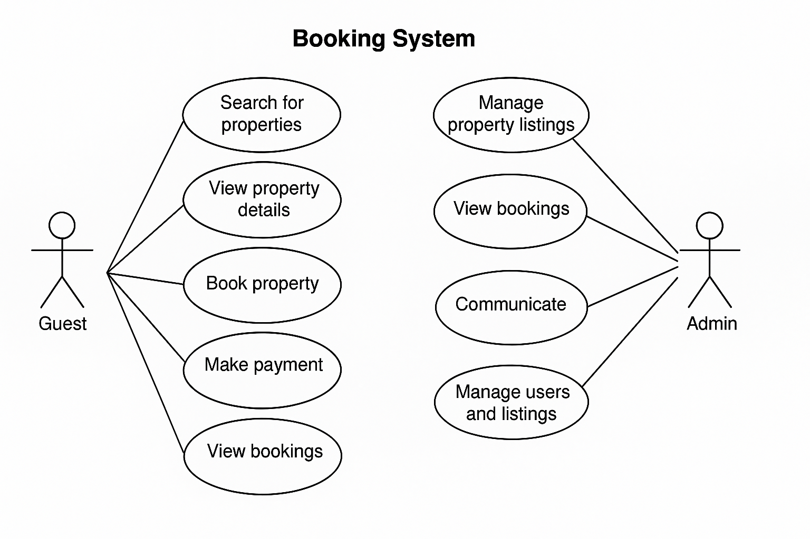

# Requirement Analysis in Software Development

## 📌 Introduction

This repository explores the process of **Requirement Analysis**, a critical phase in the Software Development Life Cycle (SDLC). It outlines how to gather, document, analyze, and validate software requirements to ensure the final product aligns with stakeholder expectations and performs reliably.

You'll find examples, diagrams, and documentation techniques used to define both **functional** and **non-functional** requirements, as well as tools to support effective analysis.

## 📖 What is Requirement Analysis?

**Requirement Analysis** is a foundational phase in the **Software Development Life Cycle (SDLC)** where the needs, expectations, and goals of stakeholders are gathered, studied, and defined. This step ensures that everyone involved in the project understands what the software should do and how it should behave.

### 🧠 Why It Matters:
- **Clarity & Alignment:** Helps developers and stakeholders agree on goals and expectations.
- **Scope Control:** Defines exactly what will be built, avoiding feature creep and miscommunication.
- **Design & Development Foundation:** Guides system architecture, UX/UI design, and technical implementation.
- **Time & Cost Estimation:** Makes it easier to plan budgets and schedules accurately.
- **Quality Assurance:** Enables testing teams to validate whether the final product meets expectations.

### ✅ Key Outputs of Requirement Analysis:
- Functional and non-functional requirements
- Use case diagrams and user stories
- Acceptance criteria
- Requirement specification documents

Ultimately, Requirement Analysis bridges the gap between the client’s vision and the developer’s implementation. It ensures that the right product gets built — the right way.

## 🌟 Why is Requirement Analysis Important?

Requirement Analysis plays a vital role in ensuring the success of any software project. It sets the foundation for all other phases of the Software Development Life Cycle (SDLC).

### 🔑 Key Reasons:

1. **Eliminates Ambiguity and Miscommunication**
   - By clearly defining what the system should do, it ensures that all stakeholders and developers share a common understanding.
   - This minimizes the risk of delivering features that don't meet user expectations.

2. **Defines Scope and Prevents Scope Creep**
   - A well-documented set of requirements helps in defining project boundaries.
   - It prevents uncontrolled changes or additions to the project, keeping timelines and budgets on track.

3. **Supports Accurate Planning and Estimation**
   - Knowing exactly what needs to be built allows teams to estimate time, effort, and costs more effectively.
   - It helps in resource allocation and scheduling.

4. **Guides Development and Testing**
   - Requirements serve as a blueprint for both developers and testers.
   - Functional and non-functional requirements help build a product that meets performance, usability, and security expectations.

5. **Improves Product Quality and Customer Satisfaction**
   - Clearly defined and validated requirements lead to a product that aligns closely with user needs, resulting in higher satisfaction and fewer costly revisions later.

## 🧩 Key Activities in Requirement Analysis

Requirement Analysis involves several structured activities that help ensure a software product is well-defined and aligned with stakeholder needs. Below are the five key activities:

- **📥 Requirement Gathering**
  - Collect information from stakeholders using interviews, surveys, observation, workshops, and document analysis.
  - Helps in understanding user expectations, existing system limitations, and project goals.

- **🧠 Requirement Elicitation**
  - Refines gathered information through brainstorming, focus groups, and prototyping.
  - Encourages deeper thinking and helps stakeholders articulate their true needs.

- **📝 Requirement Documentation**
  - Records the requirements in a structured format such as:
    - Requirement Specification Documents (SRS)
    - User Stories
    - Use Case Diagrams
  - Ensures all team members have a consistent reference.

- **📊 Requirement Analysis and Modeling**
  - Prioritizes requirements based on feasibility, importance, and business value.
  - Uses models (e.g., Data Flow Diagrams, Entity-Relationship Diagrams) to visualize the system structure and flow.

- **✅ Requirement Validation**
  - Reviews documented requirements with stakeholders to ensure accuracy, completeness, and alignment.
  - Defines clear acceptance criteria and establishes traceability for each requirement.

## 🧮 Types of Requirements

In software development, requirements are generally divided into two main categories: **Functional** and **Non-functional**. Both are essential for building a successful and user-friendly system.

### ⚙️ Functional Requirements

**Definition:**  
Functional requirements define **what the system should do** — the specific features and functionalities that allow users to achieve their goals.

**Examples (based on a hotel/booking app like Airbnb/OYO):**

- **User Registration & Login:** Users should be able to sign up, log in, and log out securely.
- **Search Properties:** Users can search available properties based on filters like location, date, price, and amenities.
- **View Property Details:** Display property images, description, pricing, and availability calendar.
- **Booking System:** Users can book a property, select dates, and make payments.
- **Booking Management:** Users can view, cancel, or modify their bookings.
- **Host Management:** Hosts can add, edit, or delete property listings.
- **Messaging System:** Enables communication between hosts and guests.

---

### 🛡️ Non-functional Requirements

**Definition:**  
Non-functional requirements describe **how the system should perform**, including performance, reliability, security, and scalability.

**Examples:**

- **Performance:** The system should return search results within 2 seconds for up to 1000 concurrent users.
- **Scalability:** The platform should support horizontal scaling to handle traffic spikes during peak seasons.
- **Security:** All user data should be encrypted during transmission (HTTPS) and stored securely (hashed passwords, secure databases).
- **Availability:** The system should have 99.9% uptime with automated failover support.
- **Usability:** The platform should provide a clean, intuitive interface that works across mobile and desktop devices.
- **Responsiveness:** The UI should adapt to various screen sizes and devices.

---

Understanding the difference between these two types of requirements helps ensure that both **functionality** and **user experience** are accounted for during development.

## 🎯 Use Case Diagrams

**What is a Use Case Diagram?**  
A Use Case Diagram is a visual representation of how different users (called **actors**) interact with a system to accomplish specific goals (called **use cases**). It helps clarify system functionalities and user interactions early in the development process.

### ✅ Benefits of Use Case Diagrams:
- Provide a high-level overview of system functionality.
- Help identify user roles and responsibilities.
- Support communication between stakeholders and developers.
- Serve as a foundation for writing user stories and test cases.

### 🏨 Use Case Diagram: Booking System

Below is a simple use case diagram for a hotel/room booking platform like Airbnb or OYO:

## 🎯 Acceptance Criteria

**What are Acceptance Criteria?**  
Acceptance Criteria are specific, measurable conditions or requirements that a software feature must meet for it to be considered complete and acceptable by stakeholders. They act as a checklist to confirm that the feature works as intended and meets user expectations.

### 🔑 Why Acceptance Criteria Matter:

- **Clarity:** They provide clear expectations for developers, testers, and stakeholders about what “done” means for each feature.
- **Validation:** Help testers verify that the functionality behaves correctly in different scenarios.
- **Scope Control:** Prevent scope creep by defining precise requirements that must be met.
- **Communication:** Facilitate better collaboration among team members and stakeholders by agreeing on acceptance upfront.
- **Quality Assurance:** Ensure features meet both functional and non-functional requirements before release.

### ✅ Example: Acceptance Criteria for Checkout Feature in Booking Management

For a **Checkout** feature in a booking system, the acceptance criteria might be:

1. Users must be able to review their booking details before confirming payment.  
2. The system must accept valid payment methods (e.g., credit card, PayPal).  
3. Upon successful payment, a confirmation message and receipt are displayed.  
4. The booking status should change to "Confirmed" immediately after payment.  
5. If the payment fails, an error message is shown, and the booking remains "Pending."  
6. The system must prevent double booking of the same property for overlapping dates.  
7. All user data entered during checkout must be securely transmitted and stored.
